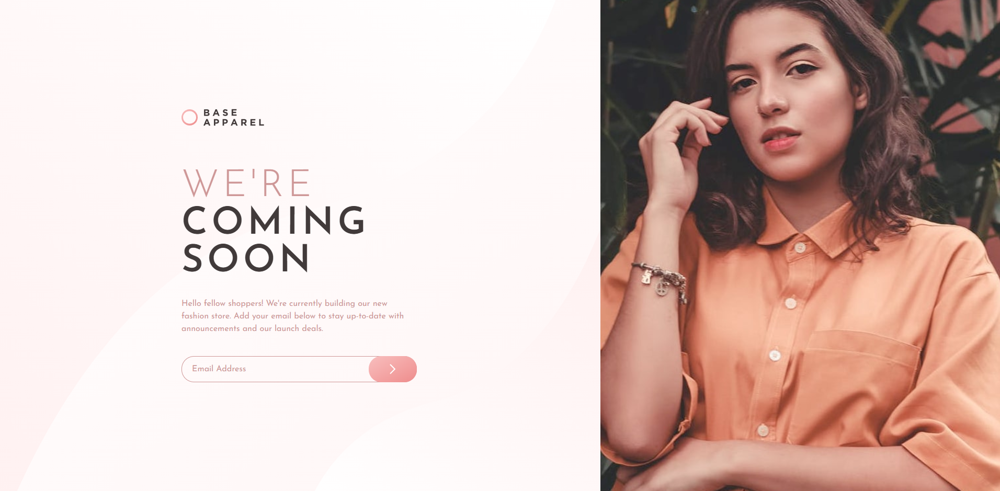
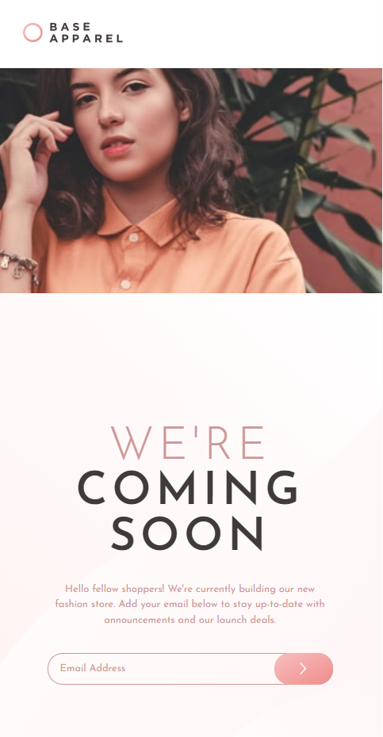

# Base Apparel – Coming Soon Page

## A clean landing page with email subscription and validation

This project implements a “coming soon” landing page for Base Apparel, featuring a two-column hero layout with an image on the right and announcement text on the left. The email subscription form includes real-time validation, providing visual feedback for incorrect input, and subtle label animations to enhance interactivity.

The component emphasizes responsive design, clear visual hierarchy, and interactive form elements, ensuring the page remains accessible and engaging across devices.

### Screenshots

#### Image of the Desktop Design

#### Image of the Mobile Design

### Email Form & Animation Features

- Email Validation: Provides immediate visual feedback when the input is invalid
- Animated Labels: Smooth transitions enhance focus and usability
- Responsive Layout: Hero image and content adjust gracefully for smaller screens
- Interactive Feedback: Users can clearly see errors, improving user experience

This project demonstrates handling form state, validation logic, and small UI animations to create a polished, user-friendly landing page.

### Built with

- [React](https://react.dev/) - JS library
- [TypeScript](https://www.typescriptlang.org/) - type superset of JS
- [Tailwindcss](https://tailwindcss.com/) - utility-first CSS framework

## Author

- Website - [Mihailo Djurovic](portfolio-miahilo.vercel.app)
